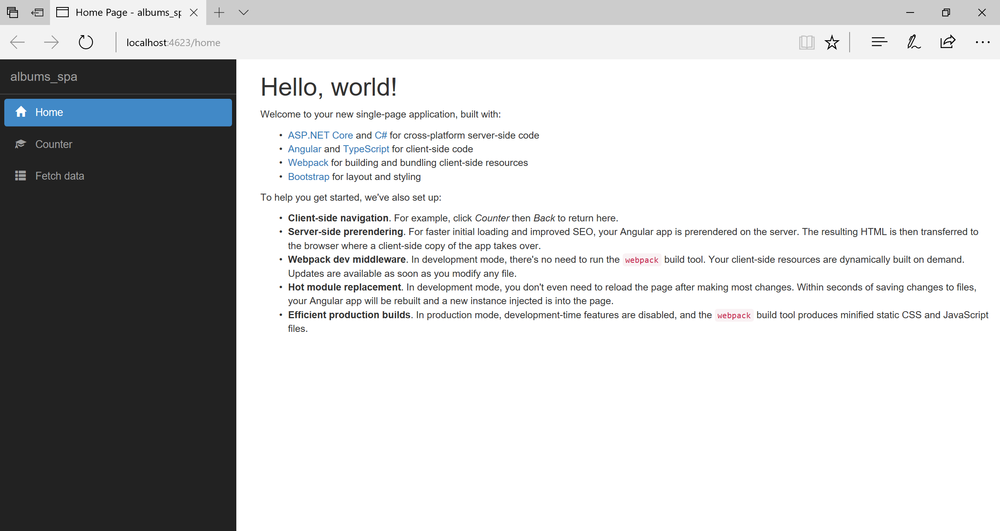
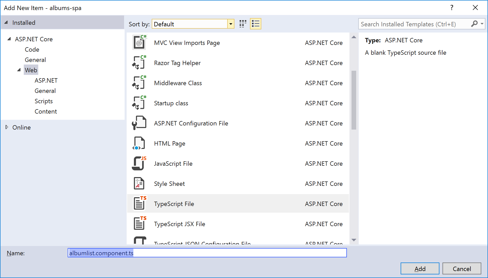
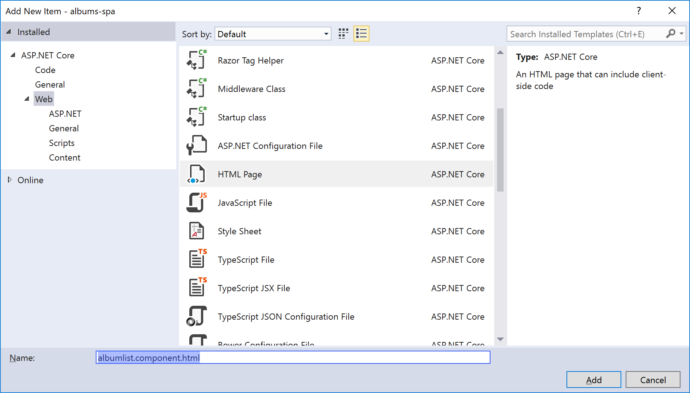
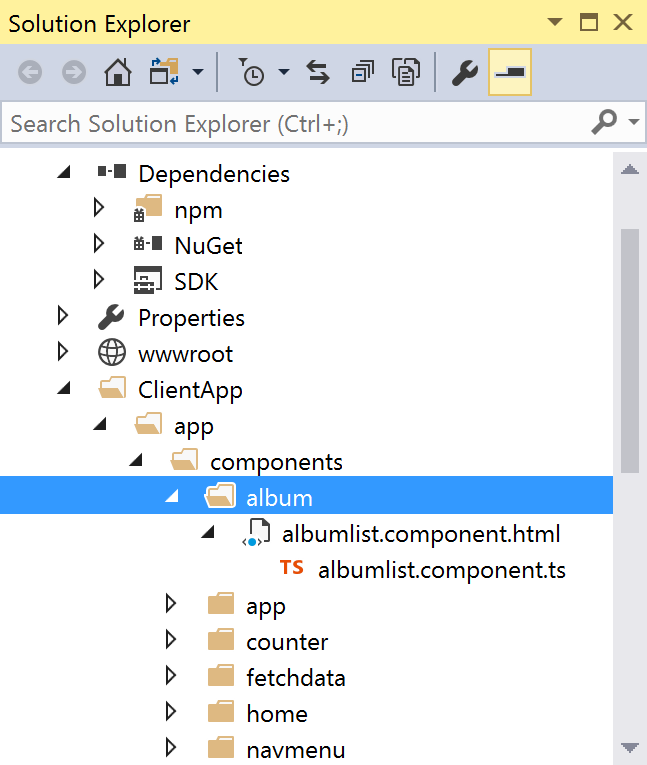
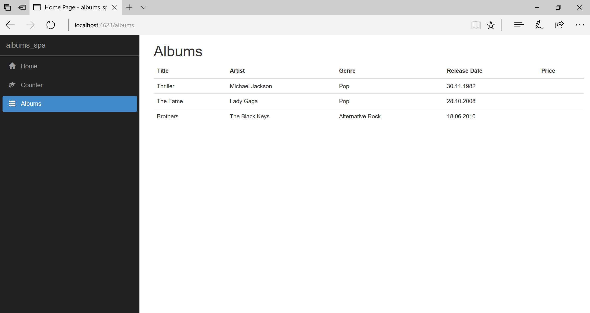
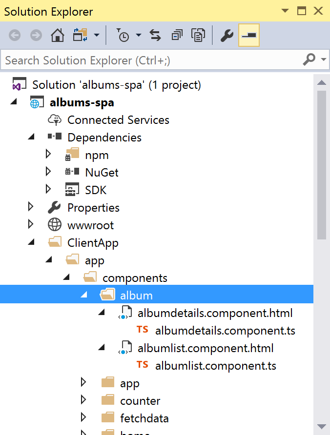
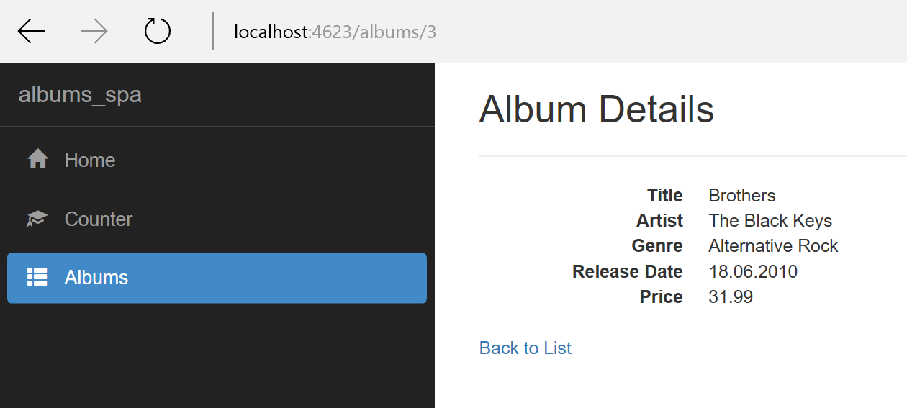
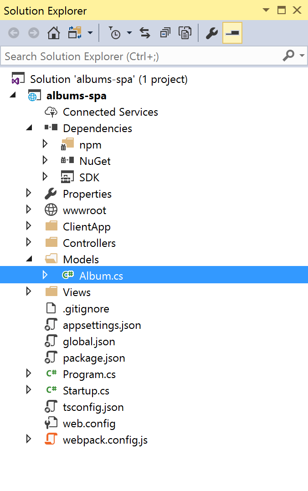
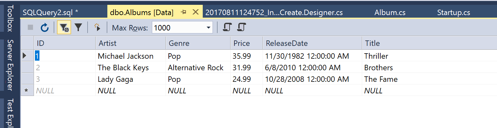

# Module 6: Single-Page Applications with Angular and ASP.NET Core

## Introduction

A single-page application (SPA) is a web application or web site that fits on a single web page with the goal of providing a user experience similar to that of a desktop application. In an SPA, either all necessary code – HTML, JavaScript, and CSS – is retrieved with a single page load, or the appropriate resources are dynamically loaded and added to the page as necessary, usually in response to user actions. The page does not reload at any point in the process, nor does control transfer to another page. Interaction with the single page application often involves dynamic communication with the web server behind the scenes.

In a traditional Web app, every time the app calls the server, the server renders a new HTML page. This triggers a page refresh in the browser. 

In an SPA, after the first page loads, all interaction with the server happens through AJAX calls. These AJAX calls return data—not markup—usually in JSON format. The app uses the JSON data to update the page dynamically, without reloading the page. The figure below the difference between the two approaches.


There are many libraries and frameworks available for creating the client-side part of a SPA. Some of the more known ones are:

- [Angular](https://angular.io/)
- [React](https://facebook.github.io/react/)
- [Vue](https://vuejs.org/)
- [Aurelia](http://aurelia.io/)
- etc.

This module uses [Angular](https://angular.io/) for building a SPA.

## Create an Angular + ASP.NET Core application

Open a command prompt, by doing Start -> Run and typing `cmd`.

Navigate to the folder where you will be creating the app. For example: 

`cd scoaladevara`

Create an empty directory for the app, and `cd` into it.

```
mkdir albumspa
cd albumspa
```

Check to see whether the SPA project templates for .NET Core are installed:

`dotnet new`

If the templates ARE installed, you should see an output similar to the following:

```
C:\Users\sorinpe\Source\scoaladevara\albumspa>dotnet new
Template Instantiation Commands for .NET Core CLI.

Usage: dotnet new [arguments] [options]

Arguments:
  template  The template to instantiate.

Options:
  -l|--list         List templates containing the specified name.
  -lang|--language  Specifies the language of the template to create
  -n|--name         The name for the output being created. If no name is specified, the name of the current directory is used.
  -o|--output       Location to place the generated output.
  -h|--help         Displays help for this command.
  -all|--show-all   Shows all templates


Templates                                     Short Name      Language      Tags
------------------------------------------------------------------------------------------
Console Application                           console         [C#], F#      Common/Console
Class library                                 classlib        [C#], F#      Common/Library
Unit Test Project                             mstest          [C#], F#      Test/MSTest
xUnit Test Project                            xunit           [C#], F#      Test/xUnit
ASP.NET Core Empty                            web             [C#]          Web/Empty
ASP.NET Core Web App                          mvc             [C#], F#      Web/MVC
MVC ASP.NET Core with Angular                 angular         [C#]          Web/MVC/SPA
MVC ASP.NET Core with Aurelia                 aurelia         [C#]          Web/MVC/SPA
MVC ASP.NET Core with Knockout.js             knockout        [C#]          Web/MVC/SPA
MVC ASP.NET Core with React.js                react           [C#]          Web/MVC/SPA
MVC ASP.NET Core with React.js and Redux      reactredux      [C#]          Web/MVC/SPA
MVC ASP.NET Core with Vue.js                  vue             [C#]          Web/MVC/SPA
ASP.NET Core Web API                          webapi          [C#]          Web/WebAPI
Solution File                                 sln                           Solution

```

If the SPA templates ARE NOT installed, the list of templates will not include `angular`, `react`, `aurelia`, `vue`, `knockout`, and any of the templates carrying a `Web/MVC/SPA` tag.

If the SPA templates are not present, you can install them with the following command:

`dotnet new --install Microsoft.AspNetCore.SpaTemplates::*`

After the above command finishes, `dotnet new` should list the SPA templates.

Now let's create an" MVC ASP.NET Core with Angular" application.

`dotnet new angular`

The command's output should be similar to this one:

```
C:\Users\sorinpe\Source\scoaladevara\albumspa>dotnet new angular
Content generation time: 731.0518 ms
The template "MVC ASP.NET Core with Angular" created successfully.
```

Now, open Visual Studio 2017.

Select File -> Open -> Project/Solution.

Navigate to the folder you just created the app in. Select the `albumspa.csproj` to open the project.

> NOTE: the name of the `.csproj` file may be different in your case.

Run the project (CTRL + F5) and verify that the app starts:



Feel free to click through some of the elements of the app.

## Add a new Angular Component

We want our application to display a list of music albums. Let's create a new [Angular component](https://angular.io/guide/architecture#components) to do that.

> NOTE: For an overview of Angular's architecture, see [this link](https://angular.io/guide/architecture).

In Visual Studio, in the `ClientApp/app/components` folder, create a new subfolder named `album`.

Right click on the newly created `album` folder, select "New Item", and add a new TypeScript file. Name the new file `albumlist.component.ts`. 



Open the `albumlist.component.ts` file and paste in the following code:

```ts
import { Component } from '@angular/core';

@Component({
    templateUrl: './albumlist.component.html',
})
export class AlbumListComponent {
    public albums;

    constructor() {

        this.albums = [
            {
                id: 1,
                title: "Thriller",
                genre: "Pop",
                artist: "Michael Jackson",
                releaseDate: "30.11.1982",
                price: "35.99"
            },
            {
                id: 2,
                title: "The Fame",
                genre: "Pop",
                artist: "Lady Gaga",
                releaseDate: "28.10.2008",
                price: "24.99"
            },
            {
                id: 3,
                title: "Brothers",
                genre: "Alternative Rock",
                artist: "The Black Keys",
                releaseDate: "18.06.2010",
                price: "31.99"
            }
        ];
    }
}

```

Right click on the `album` folder, select "New Item", and add a new HTML file. Name the new file `albumlist.component.html`. 



Open the `albumlist.component.html` file and paste in the following code:

```html
<h1>Albums</h1>

<p *ngIf="!albums"><em>Loading...</em></p>

<table class='table' *ngIf="albums">
    <thead>
        <tr>
            <th>Title</th>
            <th>Artist</th>
            <th>Genre</th>
            <th>Release Date</th>
            <th>Price</th>
        </tr>
    </thead>
    <tbody>
        <tr *ngFor="let album of albums">
            <td>{{ album.title }}</td>
            <td>{{ album.artist }}</td>
            <td>{{ album.genre }}</td>
            <td>{{ album.releaseDate }}</td>
            <td>{{ album.price }}</td>
        </tr>
    </tbody>
</table>
```

After these steps, this is how your folder structure should look like:



Now it's time to add the new `AlbumListComponent` to an [Angular NgModule](https://angular.io/guide/ngmodule), so we can use it in the app.

Open the `app/components/app.module.shared.ts file`, and add another line at the end of the `import` section:

```ts
import { AlbumListComponent } from './components/album/albumlist.component';
```

Then, in the `sharedConfig` NgModule add the `AlbumListComponent` to the end of the list of declarations:

```ts
    declarations: [
        AppComponent,
        NavMenuComponent,
        CounterComponent,
        FetchDataComponent,
        HomeComponent,
        AlbumListComponent
    ],
```

Now we need to add another route to the [RouterModule](https://angular.io/guide/router). Add it **before** the latest ** wildcard path.

```ts
    imports: [
        RouterModule.forRoot([
            { path: '', redirectTo: 'home', pathMatch: 'full' },
            { path: 'home', component: HomeComponent },
            { path: 'counter', component: CounterComponent },
            { path: 'fetch-data', component: FetchDataComponent },
            { path: 'albums', component: AlbumListComponent },
            { path: '**', redirectTo: 'home' }
        ])
    ]
```

Now open the `ClientApp/app/components/navmenu/navmenu.component.html` and change the link to the **Fetch data** list item to point to the newly created `/albums` route. Change the text of the link to **Albums**.

Here is how the nav section should look like now:

```html
        <div class='navbar-collapse collapse'>
            <ul class='nav navbar-nav'>
                <li [routerLinkActive]="['link-active']">
                    <a [routerLink]="['/home']">
                        <span class='glyphicon glyphicon-home'></span> Home
                    </a>
                </li>
                <li [routerLinkActive]="['link-active']">
                    <a [routerLink]="['/counter']">
                        <span class='glyphicon glyphicon-education'></span> Counter
                    </a>
                </li>
                <li [routerLinkActive]="['link-active']">
                    <a [routerLink]="['/albums']">
                        <span class='glyphicon glyphicon-th-list'></span> Albums
                    </a>
                </li>
            </ul>
```

Now run the application (CTRL + F5).

Notice that if you click the **Albums** link in the navbar, you can see our static list of albums:



## Create an Angular Service to work with album data

 In the `ClientApp/app` folder, create a subfoler named `services`.

 In the newly created `services` folder, add a new TypeScript file called `albums.service.ts`.

In the `albums.service.ts` file, paste in the following code:

```ts
import { Injectable } from '@angular/core';

@Injectable()
export class AlbumsService {

    private albums = [];

    constructor() {

        this.albums = [
            {
                id: 1,
                title: "Thriller",
                genre: "Pop",
                artist: "Michael Jackson",
                releaseDate: "30.11.1982",
                price: "35.99"
            },
            {
                id: 2,
                title: "The Fame",
                genre: "Pop",
                artist: "Lady Gaga",
                releaseDate: "28.10.2008",
                price: "24.99"
            },
            {
                id: 3,
                title: "Brothers",
                genre: "Alternative Rock",
                artist: "The Black Keys",
                releaseDate: "18.06.2010",
                price: "31.99"
            }
        ];
    }

    public getAll() {
        return this.albums;
    }

    public getById(id) {
        return this.albums.find(album => album.id == id);
    }
}
```
Now we need to register the newly created service as a [provider](https://angular.io/api/core/Provider). 

Open the `ClientApp/app.module.client.ts` file and add a new `import` directive:

```ts
import { AlbumsService } from './services/albums.service';
```

Now, add the `AlbumsService` class to the `providers` array of the NgModule:

```ts
    providers: [
        AlbumsService,
        { provide: 'ORIGIN_URL', useValue: location.origin }
    ]
```

Now, open the `albumlist.component.ts` file and change its contents to the following:

```ts
import { Component, OnInit } from '@angular/core';
import { AlbumsService } from '../../services/albums.service';

@Component({
    templateUrl: './albumlist.component.html',
})
export class AlbumListComponent implements OnInit {
    public albums;

    private _service: AlbumsService;

    constructor(service: AlbumsService) {
        this._service = service;
    }

    ngOnInit() {
        this.albums = this._service.getAll();
    }
}
```

## Implement the AlbumDetails component

Let's create a component to display the details of a single album.

Inside the `ClientApp/app/components/album` folder, create two new files in the same was as you did before:
- `albumdetails.component.ts`
- `albumdetails.component.html`

This is how the file structure should look like in Visual Studio:



Inside the `albumdetails.component.ts` file, paste in the following code:

```ts
import { Component, OnInit } from '@angular/core';
import { ActivatedRoute } from '@angular/router';
import { AlbumsService } from '../../services/albums.service';

@Component({
    templateUrl: './albumdetails.component.html'
})
export class AlbumDetailsComponent implements OnInit {

    public album;

    private _service: AlbumsService;
    private _route: ActivatedRoute;

    constructor(service: AlbumsService, route: ActivatedRoute) {
        this._service = service;
        this._route = route;
    }

    ngOnInit() {
        let albumId = this._route.snapshot.paramMap.get('id');
        this.album = this._service.getById(albumId);
    }
}
```

Inside the `albumdetails.component.html` file, paste in the following code:

```html
<h2>Album Details</h2>

<div>
    <hr />
    <dl class="dl-horizontal">
        <dt>Title</dt>
        <dd>{{ album.title }}</dd>
        <dt>Artist</dt>
        <dd>{{ album.artist }}</dd>
        <dt>Genre</dt>
        <dd>{{ album.genre }}</dd>
        <dt>Release Date</dt>
        <dd>{{ album.releaseDate }}</dd>
        <dt>Price</dt>
        <dd>{{ album.price }}</dd>
    </dl>
</div>
<div>
    <a [routerLink]="['/albums']">Back to List</a>
</div>
```

Open the `app/components/app.module.shared.ts file`, and add another line at the end of the `import` section:

```ts
import { AlbumDetailsComponent } from './components/album/albumdetails.component';
```
Then, in the `sharedConfig` NgModule add the `AlbumDetailsComponent` to the end of the list of declarations:

```ts
    declarations: [
        AppComponent,
        NavMenuComponent,
        CounterComponent,
        FetchDataComponent,
        HomeComponent,
        AlbumListComponent,
        AlbumDetailsComponent
    ],
```

Now we need to add another route to the [RouterModule](https://angular.io/guide/router). Add it **before** the latest ** wildcard path.

```ts
    imports: [
        RouterModule.forRoot([
            { path: '', redirectTo: 'home', pathMatch: 'full' },
            { path: 'home', component: HomeComponent },
            { path: 'counter', component: CounterComponent },
            { path: 'fetch-data', component: FetchDataComponent },
            { path: 'albums', component: AlbumListComponent },
            { path: 'albums/:id', component: AlbumDetailsComponent },
            { path: '**', redirectTo: 'home' }
        ])
    ]
```

Finally, let's change the Album List component to include a **Details** link to the new component.

Open the `albumlist.component.html` file and add another column to the `table`. 

First, add another empty `<th>` to the table header.

```html
            <th>Release Date</th>
            <th>Price</th>
            <th></th>
```

Then, add another `<td>` to the table body, with the following content:

```html
            <td>{{ album.releaseDate }}</td>
            <td>{{ album.price }}</td>
            <td><a [routerLink]="['/albums', album.id]">Details</a></td>
```

The entire `albumlist.component.html` file should look like this:

```html
<h1>Albums</h1>

<p *ngIf="!albums"><em>Loading...</em></p>

<table class='table' *ngIf="albums">
    <thead>
        <tr>
            <th>Title</th>
            <th>Artist</th>
            <th>Genre</th>
            <th>Release Date</th>
            <th>Price</th>
            <th></th>
        </tr>
    </thead>
    <tbody>
        <tr *ngFor="let album of albums">
            <td>{{ album.title }}</td>
            <td>{{ album.artist }}</td>
            <td>{{ album.genre }}</td>
            <td>{{ album.releaseDate }}</td>
            <td>{{ album.price }}</td>
            <td><a [routerLink]="['/albums', album.id]">Details</a></td>
        </tr>
    </tbody>
</table>
```

Now, run the application again. You should be able to click on the **Details** link next to each album, and view its details.



## Install Entity Framework Core

Install the package for the EF Core database provider(s) you want to target. This walkthrough uses SQL Server. 

Open the Package Manager Console (PMC): Tools > NuGet Package Manager > Package Manager Console

Enter `Install-Package Microsoft.EntityFrameworkCore.SqlServer` in the PMC.


Install the Entity Framework Core Tools to maintain the database:

Enter `Install-Package Microsoft.EntityFrameworkCore.Tools` in the PMC.


## Create the model

Define a context and entity classes that make up the model:

In Solution Explorer, right-click the project, click Add -> New Folder, and enter **Models** as the folder name.

In Solution Explorer, right-click the project's **Models** folder and select Add -> Class...:

Type **Album.cs** into the Name box, and then click Add.



Replace the Album.cs file contents with the following code:

```cs
using System;
using System.Collections.Generic;
using System.Linq;
using System.Threading.Tasks;
using Microsoft.EntityFrameworkCore;

namespace albumspa.Models
{
    public class Album
    {
        public int ID { get; set; }
        public string Artist { get; set; }
        public string Title { get; set; }
        public string Genre { get; set; }
        public DateTime ReleaseDate { get; set; }
        public decimal Price { get; set; }
    }

    public class AlbumsDbContext : DbContext
    {
        public AlbumsDbContext(DbContextOptions<AlbumsDbContext> options)
            : base(options)
        { }

        public DbSet<Models.Album> Albums { get; set; }
    }
}
```

Inside the `Controllers` folder, add a new class file. Name it `AlbumsController.cs`.

Replace the `AlbumsController.cs` contents with the following code:

```cs
using albumspa.Models;
using Microsoft.AspNetCore.Mvc;
using System.Collections.Generic;
using System.Threading.Tasks;
using Microsoft.EntityFrameworkCore;

namespace albumspa.Controllers
{
    [Route("api/[controller]")]
    public class AlbumsController : Controller
    {
        private AlbumsDbContext _dbContext;
        public AlbumsController(AlbumsDbContext dbContext)
        {
            this._dbContext = dbContext;
        }

        [HttpGet]
        public async Task<IEnumerable<Album>> Get()
        {
            return await _dbContext.Albums.ToListAsync();
        }

        [HttpGet("{id}")]
        public async Task<Album> GetById(int id)
        {
            return await _dbContext.Albums.FirstOrDefaultAsync(
                album => album.ID == id);
        }

        [HttpPost]
        public async Task<IActionResult> Post([FromBody]Album album)
        {
            _dbContext.Albums.Add(album);
            await _dbContext.SaveChangesAsync();
            return CreatedAtAction(nameof(Get), new { id = album.ID }, album);
        }
    }
}
```

## Register your context with dependency injection

Services (such as `AlbumsDbContext`) are registered with [dependency injection](http://docs.asp.net/en/latest/fundamentals/dependency-injection.html) during application startup. Components that require these services (such as your MVC controllers) are then provided these services via constructor parameters or properties.

In order for our MVC controllers to make use of `AlbumsDbContext` we will register it as a service.

Open **Startup.cs**

Add the following using statement:

```cs
using Microsoft.EntityFrameworkCore;
```

Add the `AddDbContext` method to register it as a service. Add the following code to the `ConfigureServices` method:

```cs
        // This method gets called by the runtime. Use this method to add services to the container.
        public void ConfigureServices(IServiceCollection services)
        {
            // Add framework services.
            services.AddMvc();

            // Add these two lines to register the DbContext
            var connection = @"Server=(localdb)\mssqllocaldb;Database=AlbumSpaDb;Trusted_Connection=True;";
            services.AddDbContext<Models.AlbumsDbContext>(options => options.UseSqlServer(connection));

        }
```

> NOTE: A real app would generally put the connection string in a configuration file. For the sake of simplicity, we are defining it in code. See [Connection Strings](https://docs.microsoft.com/en-us/ef/core/miscellaneous/connection-strings) for more information.

## Create the database
Once you have a model, you can use migrations to create a database.

Open the PMC:

Tools –> NuGet Package Manager –> Package Manager Console

Run `Add-Migration InitialCreate` to scaffold a migration to create the initial set of tables for your model. 

> NOTE: If you receive an error stating The term 'add-migration' is not recognized as the name of a cmdlet, close and reopen Visual Studio.

Run `Update-Database` to apply the new migration to the database. This command creates the database before applying migrations.

We can take a look at the result of the migration. Since we're using [SQL Express](https://www.microsoft.com/en-us/sql-server/sql-server-editions-express), we can connect to the database right from Visual Studio.

- In Visual Studio, select View -> SQL Server Object Explorer

- Expand the **SQL Server** node

- Find the **(localdb)\MSSQLLocalDB** server, expand Databases, 

- Expand the **AlbumSpaDb** database which was just created.

- Right click the **Albums** table and click **View Data**.

The Albums table should be empty right now. Let's get some data in there.

Still in SQL Server Object Explorer, right click the **AlbumSpaDb** database and select **New Query...**

In the new query window, paste the following query:

```sql
INSERT INTO Albums (Title, Artist, Genre, ReleaseDate, Price) VALUES
	('Thriller', 'Michael Jackson', 'Pop', '11/30/1982', 35.99)

INSERT INTO Albums (Title, Artist, Genre, ReleaseDate, Price) VALUES
	('Brothers', 'The Black Keys', 'Alternative Rock', '6/8/2010', 31.99)

INSERT INTO Albums (Title, Artist, Genre, ReleaseDate, Price) VALUES
	('The Fame', 'Lady Gaga', 'Pop', '10/28/2008', 24.99)
```

Click the Execute button to run the query.

Now, the table should display three rows, after hitting Refresh:



## Call the API from the client application

Edit the `ClientApp/app/services/albums.service.ts` file and replace its contents with the following code:

```ts
import { Inject, Injectable } from '@angular/core';
import { Http } from '@angular/http';

@Injectable()
export class AlbumsService {

    private _http: Http;
    private _originUrl: string;

    constructor(http: Http, @Inject('ORIGIN_URL') originUrl: string) {
        this._http = http;
        this._originUrl = originUrl;
    }

    public getAll() {
        return this._http.get(this._originUrl + '/api/albums');
    }

    public getById(id) {
        return this._http.get(this._originUrl + '/api/albums/' + id);
    }
}
```

Edit the `albumlist.component.ts` file and change the `ngOnInit()` function with the following:

```ts
    ngOnInit() {
        this._service.getAll().subscribe(result => {
            this.albums = result.json();
        });
```

Edit the `albumdetails.component.ts` file and change the `ngOnInit()` function with the following:

```ts
    ngOnInit() {
        let albumId = this._route.snapshot.paramMap.get('id');
        this._service.getById(albumId).subscribe(result => {
            this.album = result.json();
        });
    }
```

Now run the application again, and you should see the albums you have created in your database.