# Module 7: A Smarter Application with Microsoft Cognitive Services 

In this exercise, you will create a new ASP.NET Core Web app in Visual Studio and add code to implement the basic functionality required to upload images, write them to disk, display them in a Web page, and use Microsoft Cognitive Services to find out what is in the images.

Cognitive Services is a set of intelligence APIs that you can call from your apps. Among the more than 25 APIs it offers are the [Computer Vision API](https://www.microsoft.com/cognitive-services/en-us/computer-vision-api) for distilling actionable information from images, the [Emotion API](https://www.microsoft.com/cognitive-services/en-us/emotion-api) for recognizing emotion in images and video, and the [Text Analytics API](https://www.microsoft.com/cognitive-services/en-us/text-analytics-api) for extracting sentiments and other information from text (for example, Twitter feeds). These APIs make it possible to build smart apps that would have been impossible just a few short years ago. And they're available for you to begin using today.

## Create a new Web Application

Start Visual Studio and use the File -> New -> Project command to create a new *ASP.NET Core Web Application (.NET Core)* project named **SmartPics**.

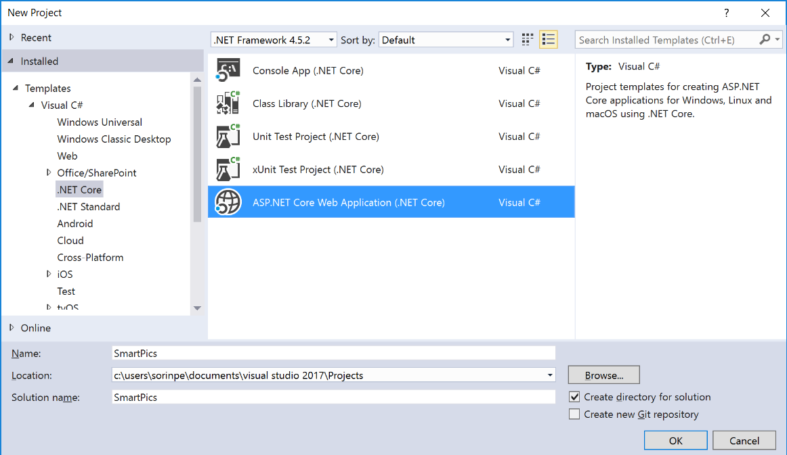

Choose *Web Application* for the template.

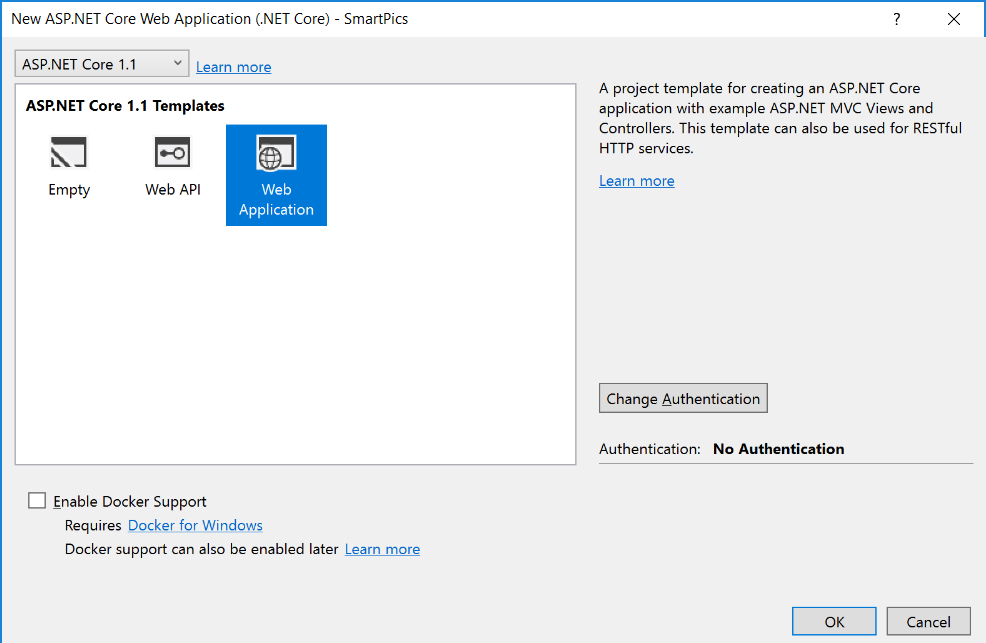

Take a moment to review the project structure in the Solution Explorer window. Among other things, there's a folder named "Controllers" that holds the project's MVC controllers, and a folder named "Views" that holds the project's views. You'll be working with assets in these folders and others as you implement the application.

Now use Visual Studio's Debug -> Start Without Debugging command (or simply press Ctrl+F5) to launch the application in your browser. Here's how the application looks in its present state:

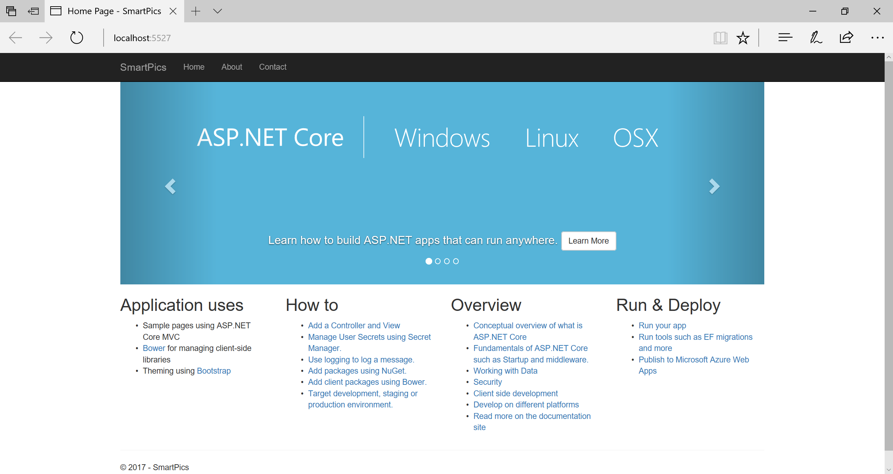

In the Solution Explorer window, find the file named _Layout.cshtml in the "Views/Shared" folder. Double-click the file to open it.

> NOTE: In an ASP.NET MVC project, _Layout.cshtml is a special view that serves as a template for other views. You typically define header and footer content that is common to all views in _Layout.cshtml.

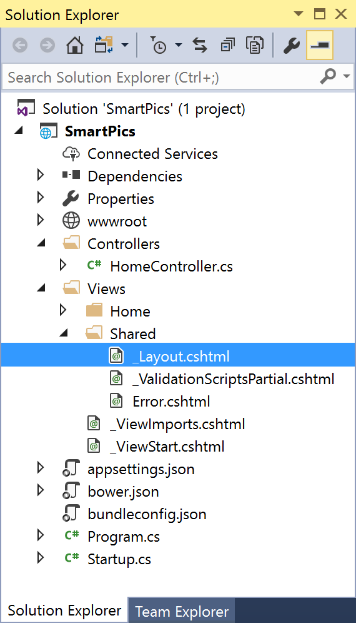

Locate the section below in the file:

```html
            <div class="navbar-collapse collapse">
                <ul class="nav navbar-nav">
                    <li><a asp-area="" asp-controller="Home" asp-action="Index">Home</a></li>
                    <li><a asp-area="" asp-controller="Home" asp-action="About">About</a></li>
                    <li><a asp-area="" asp-controller="Home" asp-action="Contact">Contact</a></li>
                </ul>
            </div>
```

Change the label *Home* from the first hyperlink to *SmartPics*.

```html
<li><a asp-area="" asp-controller="Home" asp-action="Index">SmartPics</a></li>
```

Save your changes and close _Layout.cshtml.

## Install Entity Framework Core

Install the package for the EF Core database provider(s) you want to target. This walkthrough uses SQL Server. 

Open the Package Manager Console (PMC): Tools > NuGet Package Manager > Package Manager Console

Enter `Install-Package Microsoft.EntityFrameworkCore.SqlServer` in the PMC.

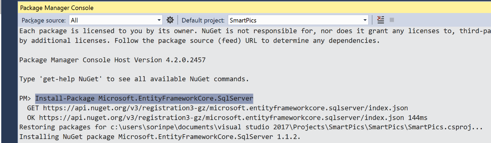

Install the Entity Framework Core Tools to maintain the database:

Enter `Install-Package Microsoft.EntityFrameworkCore.Tools` in the PMC.

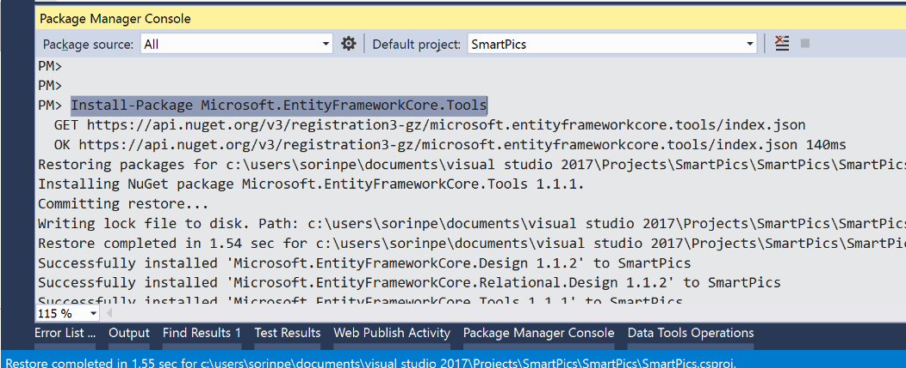

## Create the model

Define a context and entity classes that make up the model:

In Solution Explorer, right-click the project, click Add -> New Folder, and enter **Models** as the folder name.

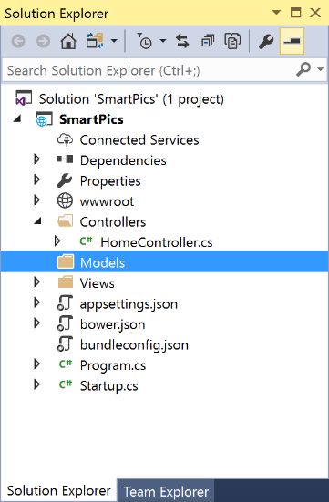

In Solution Explorer, right-click the project's **Models** folder and select Add -> Class...:

Type **PictureInfo.cs** into the Name box, and then click Add.

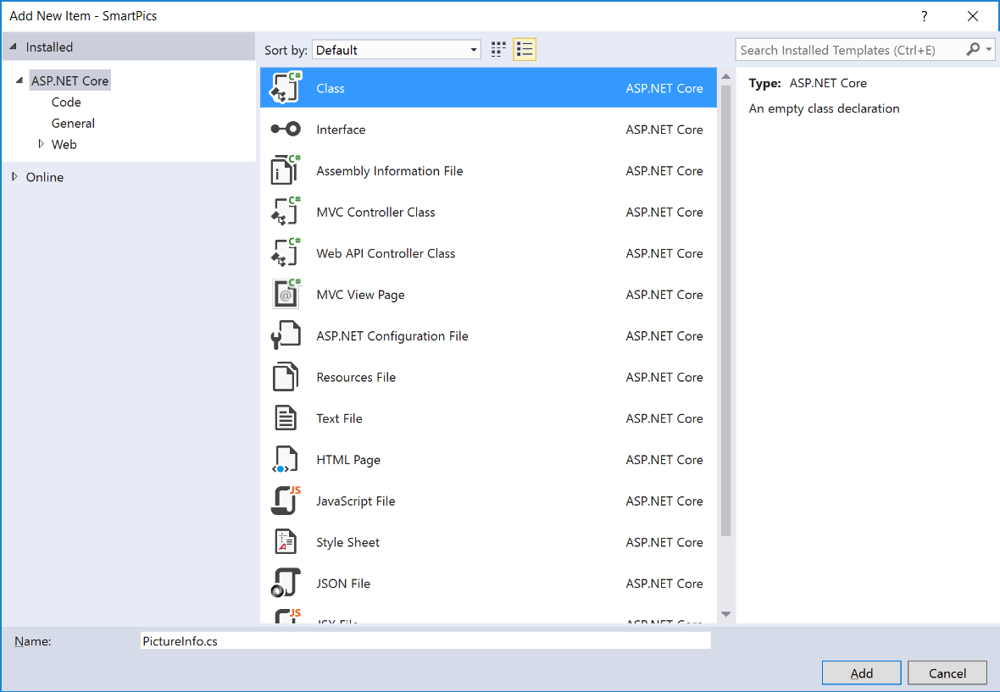

Replace the empty PictureInfo.cs file contents with the following:

```cs
using Microsoft.EntityFrameworkCore;

namespace SmartPics.Models
{
    public class PictureInfo
    {
        public int ID { get; set; }
        public string Name { get; set; }
        public string Caption { get; set; }
    }

    public class PicturesDbContext : DbContext
    {
        public PicturesDbContext(DbContextOptions<PicturesDbContext> options)
            : base(options)
        { }

        public DbSet<Models.PictureInfo> Pictures { get; set; }
    }
}
```

Now save your changes and close PictureInfo.cs.

## Register your context with dependency injection

Services (such as `PicturesDbContext`) are registered with [dependency injection](http://docs.asp.net/en/latest/fundamentals/dependency-injection.html) during application startup. Components that require these services (such as your MVC controllers) are then provided these services via constructor parameters or properties.

In order for our MVC controllers to make use of `PicturesDbContext` we will register it as a service.

Open **Startup.cs**

Add the following using statement:

```cs
using Microsoft.EntityFrameworkCore;
```

Add the `AddDbContext` method to register it as a service. Add the following code to the `ConfigureServices` method:

```cs
        // This method gets called by the runtime. Use this method to add services to the container.
        public void ConfigureServices(IServiceCollection services)
        {
            // Add framework services.
            services.AddMvc();

            // Add these two lines to register the DbContext
            var connection = @"Server=(localdb)\mssqllocaldb;Database=SmartPics;Trusted_Connection=True;";
            services.AddDbContext<Models.PicturesDbContext>(options => options.UseSqlServer(connection));
        }
```

> NOTE: A real app would generally put the connection string in a configuration file. For the sake of simplicity, we are defining it in code. See [Connection Strings](https://docs.microsoft.com/en-us/ef/core/miscellaneous/connection-strings) for more information.

## Create the database
Once you have a model, you can use migrations to create a database.

Open the PMC:

Tools –> NuGet Package Manager –> Package Manager Console

Run `Add-Migration InitialCreate` to scaffold a migration to create the initial set of tables for your model. 

> NOTE: If you receive an error stating The term 'add-migration' is not recognized as the name of a cmdlet, close and reopen Visual Studio.

Run `Update-Database` to apply the new migration to the database. This command creates the database before applying migrations.

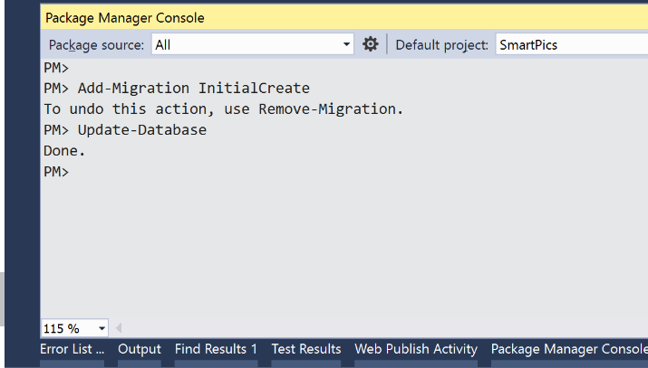

We can take a look at the result of the migration. Since we're using [SQL Express](https://www.microsoft.com/en-us/sql-server/sql-server-editions-express), we can connect to the database right from Visual Studio.

- In Visual Studio, select View -> SQL Server Object Explorer

- Expand the **SQL Server** node

- Find the **(localdb)\MSSQLLocalDB** server, expand Databases, 

- Expand the **SmartPics** database which was just created.

- Right click the **Pictures** table and click **View Data**.

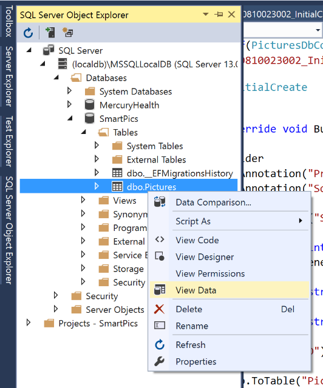

The Pictures table should be empty at this point. Let's write some code to add data into it.

## Get access to Microsoft Cognitive Services

Now comes the fun part: using [Microsoft Cognitive Services](https://www.microsoft.com/cognitive-services/) to generate captions and search keywords for the photos you upload. 

Navigate to [https://azure.microsoft.com/en-us/try/cognitive-services/](https://azure.microsoft.com/en-us/try/cognitive-services/)

Locate the **Computer Vision API** service in the list and click "Get API Key".

Select your country or region, then click next.

Log in with your preferred account.

Once you're logged in locate the **Computer Vision API** service, then locate the **Endpoint Url** and **Key 1** (the access key). You'll need them for the next steps.

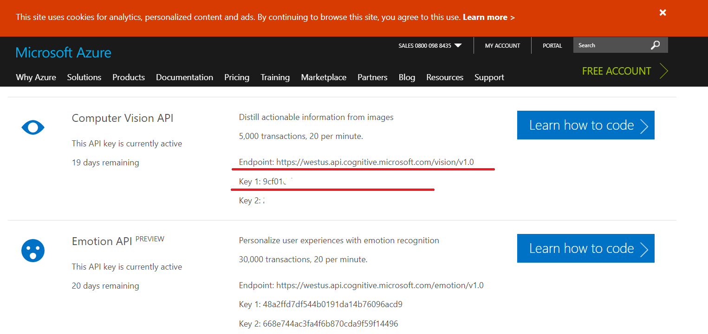

## Add the Computer Vision SDK to your Application

For accessing the Computer Vision API service, we'll be using [the official `Microsoft.ProjectOxford.Vision` NuGet library](https://www.nuget.org/packages/Microsoft.ProjectOxford.Vision/) 

Open the Package Manager Console (PMC): Tools > NuGet Package Manager > Package Manager Console

Enter `Install-Package Microsoft.ProjectOxford.Vision` in the PMC.

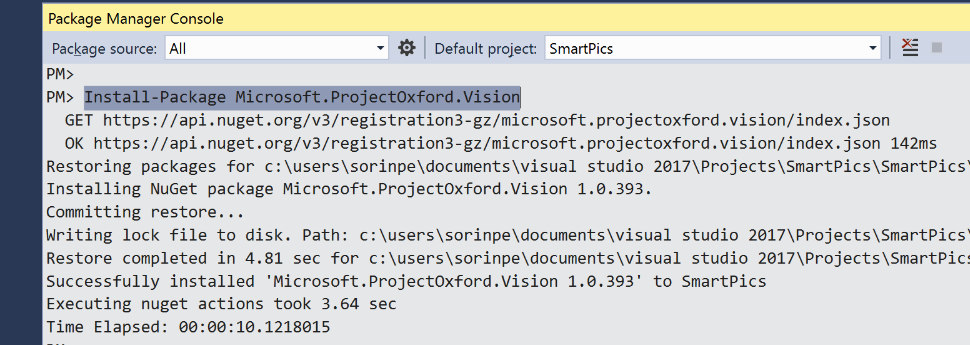

## Implement the controller action methods

In Solution Explorer, find HomeController.cs in the "Controllers" folder and double-click it to open it.

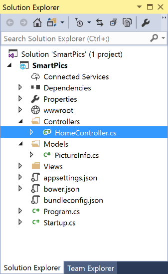

Replace the entire `HomeController.cs` contents with the following code:

```cs
using System;
using System.Linq;
using System.Threading.Tasks;
using Microsoft.AspNetCore.Mvc;
using Microsoft.AspNetCore.Hosting;
using SmartPics.Models;
using Microsoft.AspNetCore.Http;
using Microsoft.ProjectOxford.Vision;
using System.IO;
using Microsoft.EntityFrameworkCore;

namespace SmartPics.Controllers
{
    public class HomeController : Controller
    {
        private IHostingEnvironment _env;
        private PicturesDbContext _db;

        public HomeController(IHostingEnvironment env, PicturesDbContext dbContext)
        {
            _env = env;
            _db = dbContext;
        }

        public async Task<IActionResult> Index()
        {
            var Images = await _db.Pictures.ToListAsync();
            return View(Images);
        }

        [HttpPost]
        public async Task<ActionResult> Upload(IFormFile file)
        {
            if (file != null && file.Length > 0 && file.ContentType.StartsWith("image"))
            {
                var caption = String.Empty;

                using (var stream = file.OpenReadStream())
                {
                    VisionServiceClient vision = new VisionServiceClient(
                        "<subscription key>",
                        "<api root>"
                        );

                    VisualFeature[] features = new VisualFeature[] { VisualFeature.Description };
                    var result = await vision.AnalyzeImageAsync(stream, features);
                    caption = result.Description.Captions[0].Text;

                    stream.Seek(0, SeekOrigin.Begin);

                    var filePath = Path.Combine(_env.ContentRootPath, "wwwroot/images/pictures",
                            Path.GetFileName(file.FileName));
                    using (var fileStream = new FileStream(filePath, FileMode.Create))
                    {
                        await file.CopyToAsync(fileStream);
                    }
                }

                await _db.Pictures.AddAsync(new Models.PictureInfo()
                {
                    Name = Path.GetFileName(file.FileName),
                    Caption = caption
                });
                await _db.SaveChangesAsync();
            }

            // redirect back to the index action to show the form once again
            return RedirectToAction("Index");
        }

        public async Task<IActionResult> Delete(int id)
        {
            var image = _db.Pictures.FirstOrDefault(x => x.ID == id);
            if (image != null)
            {
                _db.Pictures.Remove(image);
                await _db.SaveChangesAsync();
            }
            return RedirectToAction("Index");
        }

        public IActionResult About()
        {
            ViewData["Message"] = "Your application description page.";

            return View();
        }

        public IActionResult Contact()
        {
            ViewData["Message"] = "Your contact page.";

            return View();
        }

        public IActionResult Error()
        {
            return View();
        }
    }
}
```

Feel free to examine the code before moving on to the next step.

Now, let's configure the correct endpoint and access key which our code will use to call the Computer Vision service.

Inside the newly changed class, locate this section:

```cs
    VisionServiceClient vision = new VisionServiceClient(
        "<subscription key>",
        "<api root>"
        );
```

Replace the `<subscription key>` string value with the **Key 1** string value that you received previously.

Replace the `<api root>` string value with the **Endpoint** value you received.

## Create a local folder to store pictures

Inside Solution Explorer, locate the `wwwroot/images` folder.

right click on it, select Add -> New Folder to create a new subfolder. Name that folder **pictures**.

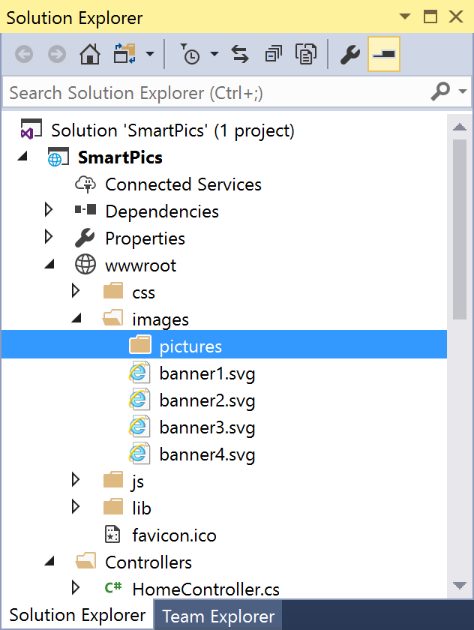

If you examine the code inside the `Upload` method, you'll see that all uploaded files will get stored in the folder we just created:

```cs
var filePath = Path.Combine(_env.ContentRootPath, "wwwroot/images/pictures",
                             Path.GetFileName(file.FileName));
using (var fileStream = new FileStream(filePath, FileMode.Create))
{
    await file.CopyToAsync(fileStream);
}
```

Now it's time to create the view to display the pictures.

## Implement the View

In Solution Explorer, locate and open the `Views/Home/Index.cshtml` file.

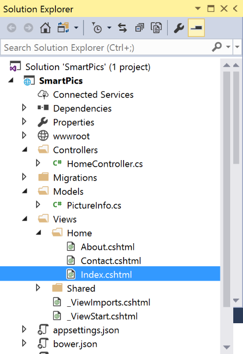

Clear all the current view code, and replace it with the following: 

```html
@{
    ViewData["Title"] = "Home Page";
}

@using SmartPics.Models
@model IList<PictureInfo>

<div class="container" style="padding-top: 24px">
    <div class="row">
        <div class="col-sm-8">
            @using (Html.BeginForm("Upload", "Home", FormMethod.Post, new { enctype = "multipart/form-data" }))
            {
                <input type="file" name="file" id="upload" style="display: none" onchange="$('#submit').click();" />
                <input type="button" value="Upload a Photo" class="btn btn-primary btn-lg" onclick="$('#upload').click();" />
                <input type="submit" id="submit" style="display: none" />
            }
        </div>
        <div class="col-sm-4 pull-right">
        </div>
    </div>

    <hr />

    <div class="row">
        <div class="col-sm-12">
            @foreach (var picture in Model)
            {
                <div style="padding: 10px" width="192">
                    
                    <div>@picture.Caption</div>
                </div>

            }
        </div>
    </div>
</div>
```

Now, hit **CTRL + F5** to run the application without debugging (or **F5** to run it with debugging enabled).

In the main page of the website, click **Upload** to upload a JPEG or PNG file. 

> NOTE: You can use the [sample photos](photos/) we provided in this repo; alternatively feel free to use [Bing Image Search](https://www.bing.com/images/detail/search?iss=sbi) to find interesting pictures to use.

For each photo, you should see a caption underneath it.

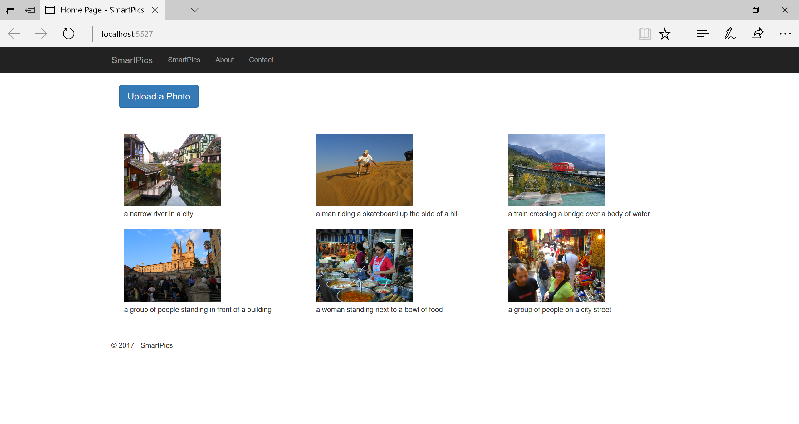

If you look inside the **Pictures** table of the **SmartPics** database, you will see a row for every picture you added:

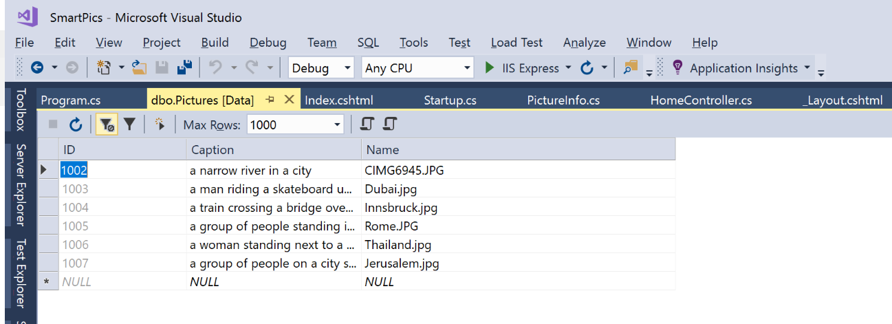

 you look inside the `wwwroot/images/pictures` folder in the application directory, you should see the actual photos there:

 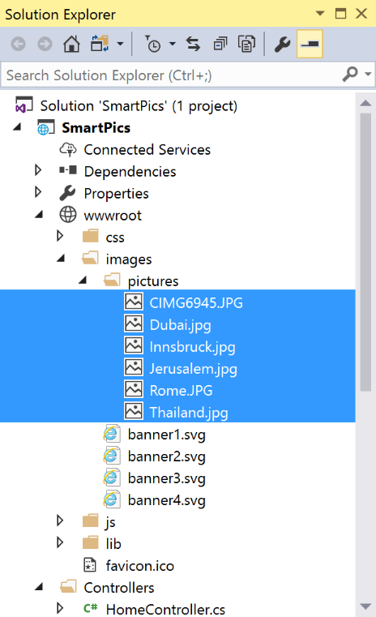

 ## Additional exercises

 1. Implement `Delete` functionality to allow users to delete pictures. Here is a possible mock-up of the user interface:

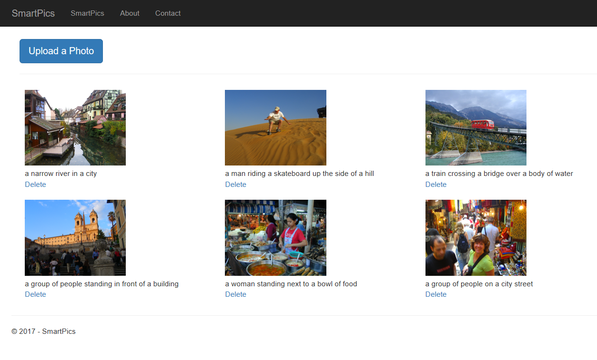

2. Implement a search box to filter images by their caption.